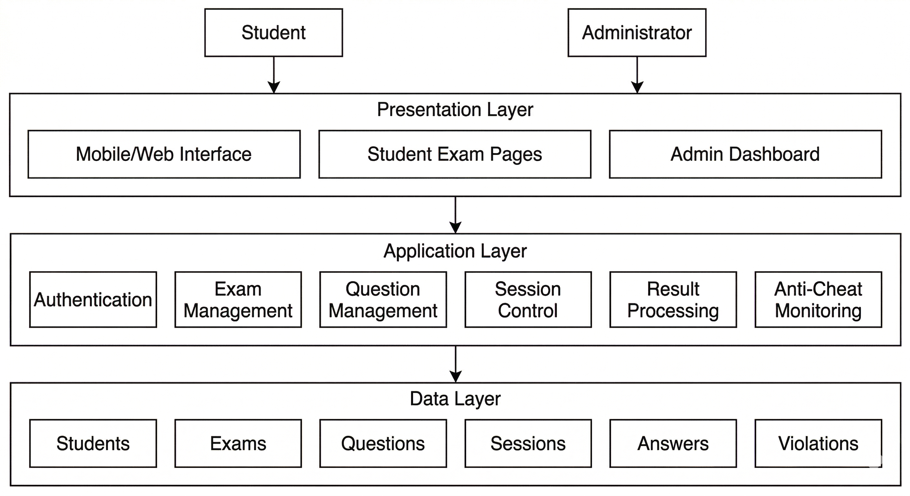
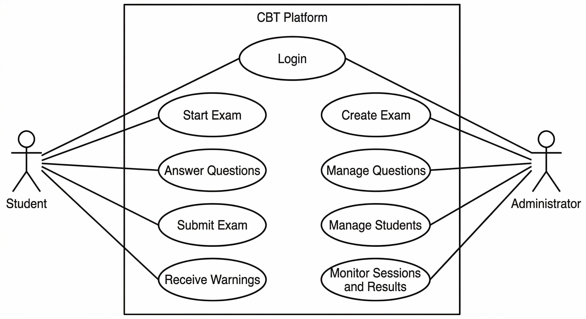
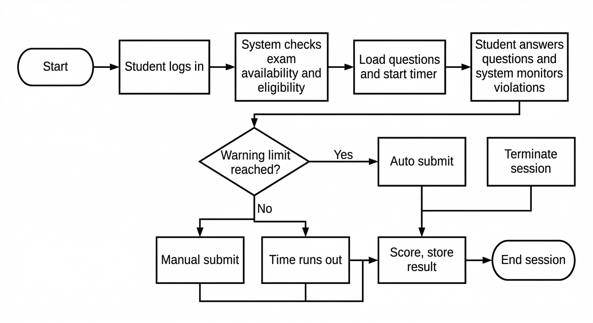
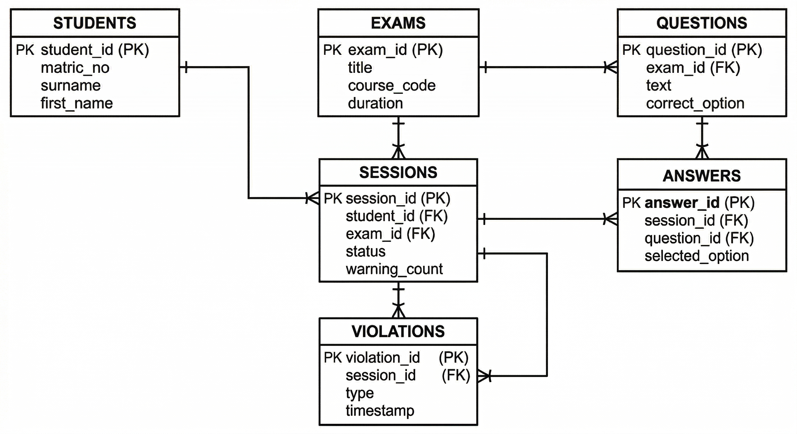

# CHAPTER THREE

## SYSTEM ANALYSIS AND DESIGN

### 3.1 Analysis of the Existing System

The existing examination arrangement in many departments can be described as either fully manual or only partly computerized. In the manual method, lecturers prepare questions, print them, supervise students physically during the examination, collect answer booklets, and later mark the scripts by hand. This method has been used for many years and is still familiar to both staff and students. However, it becomes difficult to manage when the number of students is high, when there are many courses to examine at the same time, or when quick result processing is required.

The manual arrangement also creates pressure in several areas. Question papers must be printed and protected before the examination. Invigilators must supervise students physically throughout the exam period. After the examination, scripts must be sorted, marked, and recorded manually. At each of these stages, there is a chance of delay, misplacement, human error, or weak record handling. As class size continues to increase, the pressure on the department also increases.

In some cases, departments may use a simple CBT platform instead of a fully paper-based process. This improves speed in some areas, especially for objective questions, but it still does not solve all the major problems. Some available CBT systems are built mainly for desktop use and may not work smoothly on smartphones. Some also provide only basic exam delivery without enough control over suspicious behaviour during the examination. As a result, the system may be digital, but still not sufficiently secure, flexible, or easy to use.

For the purpose of this study, the existing system is therefore seen as an examination arrangement that does not fully support mobile accessibility, strong session control, proper monitoring of suspicious actions, or better administrative supervision during live exams. This makes it necessary to design a more focused and reliable standalone CBT platform.

#### 3.1.1 Architecture of the Existing System

The architecture of the traditional existing system is simple and mostly manual. The lecturer is responsible for setting the questions and preparing the examination materials. The department arranges printing and basic logistics. Students sit for the examination in a physical hall, answer the questions with pen and paper, and submit the scripts to the invigilator. The scripts are then returned to the lecturer for marking and later recorded manually into departmental result sheets.

This structure can be represented as a direct flow from lecturer to printed question paper, then to student, then to invigilator, and finally back to the lecturer for marking and result preparation. The process depends heavily on human handling at every stage. This means that the quality of the examination process depends not only on the questions themselves, but also on how well people manage printing, supervision, collection, marking, and record keeping.

Where a simple CBT platform exists, the architecture improves only slightly. In that case, the lecturer or administrator enters the questions into the platform, students log in through available devices, the examination is taken on screen, and the result may be computed automatically for objective questions. Even then, the arrangement may still be weak if the platform does not support proper session monitoring, mobile usability, or violation control.

#### 3.1.2 Advantages of the Existing System

One advantage of the existing manual system is familiarity. Lecturers, invigilators, and students are already used to the general process, so little technical training is required before the examination takes place. This can make planning easier in environments where digital literacy is low or where technical support is not always available.

Another advantage is that the manual system does not depend entirely on internet connectivity or digital devices during the examination. Where electricity, network access, or device availability may be uncertain, paper-based testing can still continue. This gives the department a backup option when technical infrastructure is weak.

A simple CBT system also has a few advantages over the manual method. It can reduce the stress of marking objective questions, produce results faster, and store some records in digital form. It may also reduce paper use and help the department organize examination data better than a fully manual arrangement.

Despite these advantages, the existing system still does not fully meet the present needs of a department that wants a mobile-friendly, better controlled, and more organized examination platform.

#### 3.1.3 Limitations of the Existing System

The limitations of the existing system are more serious than its advantages. In the manual system, marking takes time and becomes tiring when student numbers are high. Record keeping can also become difficult because scripts, mark sheets, and related documents must be handled physically. Delays in marking may affect result release, and human error may affect scoring, compilation, or storage.

The manual method also makes monitoring more stressful because invigilators must depend mainly on physical observation. While physical supervision can be effective in some cases, it becomes harder to manage fairly when there are many students, limited manpower, or pressure during examination periods. In addition, manual systems do not automatically provide activity records, warning logs, or digital reports that can help management review what happened during an examination.

For basic CBT systems, the limitations appear in another form. Some platforms are not properly designed for mobile screens, and this becomes a real problem when students rely more on smartphones than on laptops. If the system is difficult to navigate on a phone, it can affect student concentration and performance. Question display, button size, timing visibility, and navigation all become important in such a situation.

Another major limitation is weak anti-cheat monitoring. If the system does not watch for tab switching, fullscreen exit, copy and paste attempts, right-click behaviour, or repeated session interruption, then suspicious behaviour may go unchecked. This reduces confidence in the fairness of the examination and may discourage wider departmental use of the platform.

There is also the problem of weak session control in some systems. Where administrators cannot properly pause a session, resume a student, review warnings, or force final submission when necessary, the system becomes harder to manage during a live examination. These weaknesses justify the need for a more structured standalone CBT platform.

### 3.2 Analysis of the Proposed System

The proposed system is a standalone mobile-first anti-cheat CBT platform for the Department of Computer Science, Federal University of Petroleum Resources, Effurun. It is designed to improve examination administration by combining mobile accessibility, practical anti-cheat features, timed session control, structured question management, and better administrative monitoring in one web-based platform.

The system is called standalone because it is built as an independent examination platform rather than as a small unit inside a larger school portal. This is important because it allows the examination features to be designed more clearly around the actual needs of departmental CBT use. The system can therefore focus fully on examination creation, student access, session monitoring, answer handling, and result processing without being mixed with unrelated portal functions.

The proposed system also adopts a mobile-first approach. This means that the interface is planned first with mobile use in mind before it is adapted for larger screens. This is important because many students are more likely to access the system through smartphones than through desktop computers. A mobile-first system improves readability, button arrangement, navigation, and overall usability on smaller screens.

In addition to usability, the proposed system is built around practical examination control. The system will not claim to remove cheating completely, but it will provide realistic controls that make suspicious behaviour harder to hide. It will record violations, count warnings, apply control rules, and provide administrators with better visibility into ongoing sessions.

#### 3.2.1 Architecture of the Proposed System

The proposed system follows a web-based three-layer architecture. The first layer is the presentation layer. This is the layer through which students and administrators interact with the platform. It includes the student login page, exam interface, timer view, warning messages, question navigation, and the administrator dashboard for creating exams, managing students, reviewing sessions, and handling results.

The second layer is the application layer. This is the part of the system that processes requests and controls system behaviour. It handles authentication, exam access validation, session creation, timer control, question randomization, answer storage, result computation, warning updates, and administrator session actions such as pause, resume, and final submission. This is also the layer where the anti-cheat rules are implemented. Browser events such as fullscreen exit, tab switching, copy and paste attempts, right-click attempts, and developer tools shortcuts are detected here and passed into the warning logic of the system.

The third layer is the data layer. This is the storage layer of the platform. It keeps student records, exam records, question records, session records, submitted answers, result values, and violation logs. The database makes it possible for the system to save information, update it when necessary, and retrieve it for reporting and result review.

The flow of activity in the proposed architecture is straightforward. The user sends a request through the interface, the application logic checks and processes that request, and the database stores or returns the needed information. This arrangement helps to keep the system organized, easier to maintain, and easier to improve later.

Figure 3.1 presents the architecture of the proposed standalone CBT platform.

Figure 3.2 presents the main use cases of the proposed system and the two major actors that interact with it.

#### 3.2.2 Advantages of the Proposed System

The proposed system has several clear advantages over the existing arrangement. The first is improved accessibility. Since the platform is mobile-first, students can use it more easily on smartphones, which are often more available than personal computers. This can improve access and reduce some of the usability problems found in platforms that were not designed with mobile screens in mind.

The second advantage is stronger examination control. The proposed system provides practical anti-cheat monitoring by detecting suspicious actions and keeping warning records. This helps the department respond to common integrity issues in a more structured way. The system also makes it possible to define a maximum warning limit and apply control when that limit is exceeded.

Another advantage is improved administrative supervision. Administrators can create examinations, manage questions, manage student records, monitor active sessions, and review violations from one organized dashboard. This gives the department more confidence and control during exam periods.

The system also improves speed and digital record handling. Questions, sessions, answers, violations, and results are stored in structured form. This reduces dependence on manual handling and makes later review easier. Objective scoring becomes faster, and the platform can support better reporting than a traditional paper-based process.

Finally, the proposed system is more suitable for departmental deployment because it is focused and realistic. It does not try to solve every university-wide problem at once. Instead, it provides a practical and manageable solution for one academic department.

### 3.3 Methodology

The software development methodology adopted for this work is the incremental development methodology. This methodology is suitable for the project because the system can be developed in parts, tested in parts, and improved gradually until the complete platform is ready. Instead of waiting until everything is built before testing, the incremental approach allows each major module to be developed and checked separately.

The first activity in the methodology is requirement identification. At this stage, the core needs of the project are clearly defined. These include student access, exam creation, question handling, mobile usability, timing control, anti-cheat monitoring, session control, and result handling. This stage is important because it helps the system designer understand the real problem before implementation begins.

The second activity is system analysis. At this stage, the weaknesses of the existing examination process are studied carefully. The goal is to identify where delays, usability problems, weak monitoring, and poor record handling occur. This helps in deciding what the proposed system must improve.

The third activity is system design. At this stage, the structure of the new system is planned. The main interfaces, data structure, process flow, and system modules are designed. Design tools such as system architecture diagrams, use case diagrams, flowcharts, and the entity relationship diagram are useful at this stage because they give a visual explanation of how the platform will work.

The fourth activity is implementation. At this stage, the design is translated into an actual working system. The administrator dashboard, student exam interface, timer logic, question handling, session monitoring, violation handling, and scoring logic are all developed as separate but connected parts of the platform.

The fifth activity is testing and evaluation. Here, the completed modules are checked to ensure that they work correctly. Important test areas include student login, exam start conditions, answer submission, timer behaviour, warning updates, randomization, automatic submission, and administrator control actions.

The final activity is refinement and documentation. Errors found during testing are corrected, the interface is improved where necessary, and the final system documentation is prepared. This methodology is suitable for the present study because it supports gradual development, easier testing, and continuous improvement.

### 3.4 Methods of Requirement Gathering

For this study, the information needed to design the proposed system was gathered through requirement-focused methods rather than through any form of dataset collection. Since the project is a software design and implementation project, the main concern is to understand the intended users, the current examination process, the major weaknesses in that process, and the practical features needed in the new system. The methods used in this section helped to identify what the system should do and the conditions under which it should operate well.

#### 3.4.1 Observation

Observation was used to understand how examinations are commonly conducted and where practical problems usually occur. Through observation, it becomes easier to identify issues such as the stress of manual supervision, delay in result handling, weak record organization, and the difficulty of managing large numbers of students. Observation also helps in understanding what students and administrators need from a platform during a live examination.

Observation is especially useful because some examination problems are easier to notice in practice than through theory alone. For example, it shows how timing pressure affects exam management, how difficult it can be to control many students at once, and how quickly small mistakes in organization can create larger problems during examination periods.

#### 3.4.2 Informal Interview

Informal interview was also used as a method of gathering system requirements. Through informal discussion with likely users such as students, lecturers, and administrators, it becomes possible to understand the kind of features that are most important in the proposed system. These discussions help reveal practical concerns such as the need for a simple interface, the importance of smartphone compatibility, and the desire for stronger exam monitoring.

This method is valuable because users often explain their needs in simple practical terms. Students may focus on ease of use, visibility of time, and smooth navigation. Administrators may focus more on question management, session monitoring, and better control during live exams. These inputs help shape the design of the platform.

#### 3.4.3 Document Review

Document review was used to study published materials and previous works related to CBT, online assessment, mobile learning, and academic integrity. This method helps in understanding the broader ideas behind the proposed system and in identifying common features that have been discussed in earlier research. It also helps in confirming that the problem of mobile usability and exam integrity is already recognized in academic literature.

Document review is important because it connects the practical system design to existing knowledge. It helps ensure that the proposed system is not only based on personal opinion but also supported by relevant academic ideas and earlier studies.

#### 3.4.4 Requirement Preparation

After observation, informal interview, and document review, the identified needs were organized into system requirements. These requirements include student login, administrator access, exam setup, question management, session monitoring, anti-cheat control, timing logic, answer handling, and result processing. The purpose of this stage is to convert raw information from users and documents into clear features that can be implemented in the system.

### 3.5 Design Specification

The design specification explains what the proposed system is expected to do, the quality standards it should meet, the kinds of inputs and outputs it handles, and the main processes that connect all parts of the platform. In software engineering terms, this section moves from general system description to more specific system requirements. It therefore shows both the behaviour expected from the platform and the conditions that make the platform usable, reliable, and suitable for departmental examination use.

#### 3.5.1 Functional Requirements

Functional requirements describe the specific services and operations that the proposed CBT platform must provide. These requirements explain what the system should do for students and administrators during normal use.

1. The system shall allow registered students to log in and access their assigned examination.
2. The system shall validate whether an examination is active and whether the student is eligible to start it within the approved exam window.
3. The system shall create and manage a timed exam session for each student.
4. The system shall display examination questions and answer options clearly on both mobile devices and larger screens.
5. The system shall allow students to move through questions and submit answers during the examination.
6. The system shall support full-exam timing and other timing controls defined by the administrator.
7. The system shall support question randomization and option shuffling where such settings are enabled.
8. The system shall detect suspicious actions such as tab switching, fullscreen exit, copy or paste attempts, right-click attempts, and developer-tools shortcut attempts.
9. The system shall record each detected violation and update the warning count for the affected session.
10. The system shall automatically submit or terminate a session when the defined warning limit is reached.
11. The system shall allow administrators to create examinations and configure key settings such as duration, passing score, exam window, and anti-cheat limits.
12. The system shall allow administrators to add, edit, import, and organize examination questions.
13. The system shall allow administrators to add, edit, and manage student records.
14. The system shall allow administrators to monitor active examination sessions and review violation logs.
15. The system shall allow administrators to pause, resume, and force final submission of student sessions where necessary.
16. The system shall process submitted answers, compute results where applicable, and store the session outcome for later review.

These functional requirements reflect the core operations of the proposed platform. They show that the system is not only an exam-delivery interface, but a complete departmental CBT environment with student interaction, administrative control, and built-in session monitoring.

#### 3.5.2 Non-Functional Requirements

Non-functional requirements describe the quality expectations of the system. They do not focus on what the platform does, but on how well it should perform while carrying out its functions.

1. The system shall be easy to use and understandable to both students and administrators.
2. The system shall be mobile-responsive so that it works effectively on smartphones, tablets, laptops, and desktop computers.
3. The system shall respond within a reasonable time during login, question loading, answer submission, and administrative actions.
4. The system shall maintain reliable timing and session state throughout the examination.
5. The system shall preserve data integrity so that answers, warnings, and results are not lost or mixed across sessions.
6. The system shall support secure access control for both students and administrators.
7. The system shall remain maintainable so that future updates to exam settings, anti-cheat rules, and user management can be made more easily.
8. The system shall provide a clear and organized interface that reduces confusion during live examinations.
9. The system shall support availability during examination periods so that students can complete scheduled sessions without unnecessary interruption.

These non-functional requirements are important because a CBT platform may be functionally complete and still fail in practice if it is slow, confusing, unstable, or difficult to maintain. For this reason, the present study treats quality requirements as a major part of system design.

#### 3.5.3 Input/ Output Specification

The input and output specification describes the information that enters the system and the information produced by the system. This part supports the functional requirements by showing the actual data and responses involved in exam administration and exam taking.

The input side of the platform includes all records entered by students, administrators, or system monitoring logic. These inputs include login details, student records, exam settings, question records, selected answers, violation events, and administrator control actions. Each of these inputs contributes directly to how the system behaves during an examination session.

The output side of the platform includes the visible and recorded responses produced by the system. These outputs include the exam interface presented to students, timer updates, warning notifications, session status information, result outputs, and administrative monitoring information. These outputs make the platform useful both during and after the examination.

#### Table 3.1 Input Specification

| Input Type | Source | Description |
|---|---|---|
| Student login data | Student | Matric number and login credentials used to access the exam |
| Student record | Administrator | Student biodata such as matric number, surname, and first name |
| Exam record | Administrator | Exam title, course code, duration, timer mode, exam window, and control settings |
| Question record | Administrator | Question text, options, correct answer, marks, and question order |
| Answer submission | Student | Selected answer for each question during the examination |
| Violation event | System | Tab switch, fullscreen exit, copy or paste attempt, right-click attempt, and related events |
| Session control action | Administrator | Pause, resume, or final submit action applied to a student session |

#### Table 3.2 Output Specification

| Output Type | User | Description |
|---|---|---|
| Student exam interface | Student | Display of exam questions, options, timer, and navigation controls |
| Warning notification | Student | Message shown when a suspicious action is detected |
| Session status update | Student / Administrator | Current state of the exam such as in progress, paused, submitted, or terminated |
| Result output | Student / Administrator | Score, performance result, and submission state where applicable |
| Violation log | Administrator | Record of detected suspicious actions during the examination |
| Session monitoring view | Administrator | Dashboard showing student sessions and current exam status |

#### 3.5.4 Process Design

The process design explains how the major activities of the proposed system happen from beginning to end. It shows how the administrator prepares the examination, how the student enters the exam, how monitoring takes place during the session, and how the final result is produced and stored.

##### 3.5.4.1 Examination Setup Process

In the examination setup process, the administrator creates an examination by entering the exam title, course code, description, duration, timer mode, question layout, passing score, allowed exam window, and anti-cheat settings. After the exam settings have been saved, the administrator adds questions manually or imports them into the platform. The questions may then be reviewed, arranged, and activated for student use.

This process is important because it determines how the examination will behave when students begin to access it. Proper exam setup ensures that timing rules, control rules, and question arrangements are already in place before the exam starts.

##### 3.5.4.2 Student Login and Exam Start Process

In this process, the student provides the required login details and requests access to the exam. The system checks whether the student record is valid, whether the examination is active, whether the allowed exam window is still open, and whether the student is permitted to begin the session. If all required conditions are met, the exam session starts and the timer begins.

This process is important because it prevents unauthorized access and ensures that students only begin the exam under the proper conditions defined by the administrator.

##### 3.5.4.3 Examination Monitoring and Violation Handling Process

During the examination, the system keeps monitoring the student session. If the student leaves the exam screen, exits fullscreen mode, attempts to copy or paste content, uses right-click, or triggers a developer-tools shortcut, the system records the event as a violation. The warning count is then updated and compared with the allowed warning limit.

If the warning limit has not yet been reached, the exam continues and the student is warned. If the warning limit is reached, the system applies the defined control rule by ending the session automatically. This process helps the department maintain more practical control over suspicious behaviour during the examination.

##### 3.5.4.4 Submission and Result Processing Process

At the end of the examination, the student may submit the exam directly, or the system may submit it automatically when the time expires or when the warning limit is exceeded. After submission, the system processes the stored answers, calculates the score, updates the session status, and stores the result in the database.

This process reduces manual scoring stress and ensures that examination records are stored in a more structured digital form. It also makes later result review easier for the administrator.

##### 3.5.4.5 Administrative Session Control Process

The proposed system also provides administrator control over active sessions. Through the dashboard, the administrator can review current sessions and take action when necessary. These actions include pausing a student's session, resuming a paused session, and forcing final submission.

This process is important because it gives the department a practical way to respond to special situations during live examinations. It improves supervision and makes the examination system more manageable.

Figure 3.3 shows the flow of student interaction with the system from login to final submission.

Figure 3.4 shows the main data entities of the proposed system and how they are related.

